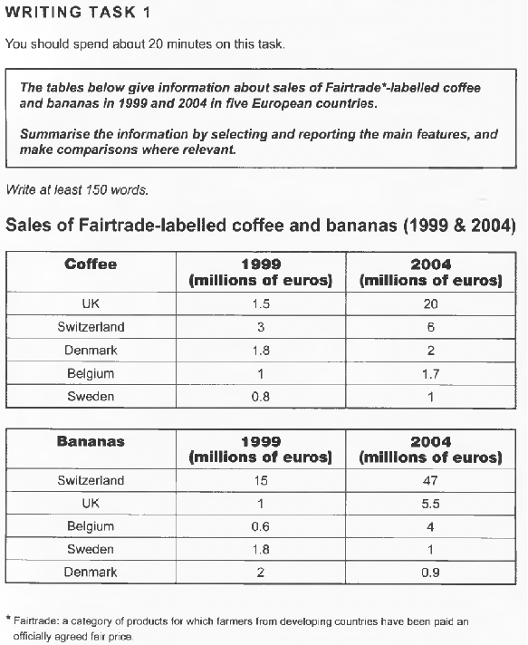
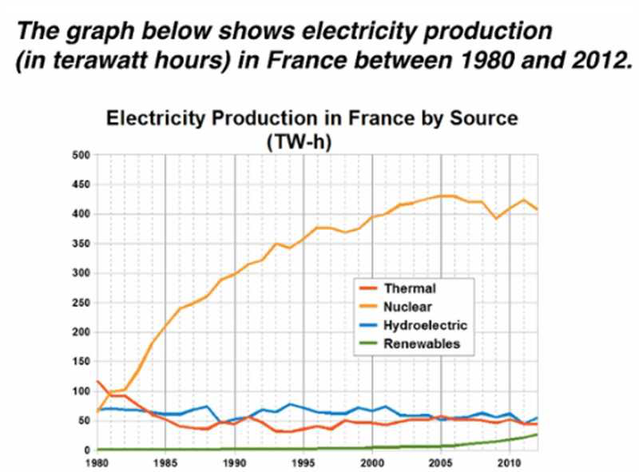

# 写作

1. 小作文--20min--$\frac{1}{3}$--图表
2. 大作文--40min--$\frac{2}{3}$--议论

# 小作文

## 类型

1. bar chart 柱状图
2. line graph 线形图
3. Pie chart 饼状图
4. table 表格
5. map 地图
6. flow chart/diagram 流程图

illustrate v.说明

## 结构

4段/5段

1. introduction
   1. 1 sentence
2. overview
   1. 2 sentences(趋势/主要特征(max/min))
3. detail paragraph 1
   1. 描述数据方法
      1. 分别描述
      2. 倍数
      3. 差值
      4. 趋势
      5. points
      6. rank
4. detail paragraph 2

## 读题

1. 审题

   1. Topics:
   2. Figure/number/percentage:单位...
   3. Tense(时态):

   

   1. Topics:sale change in different country and in different time
   2. Table:
   3. Tense:过去(一般过去/过去完成)

2. 提纲

   1. 分段：detail para 1和detail para 2怎么去分配
   2. 要点
      1. overview
         1. trends
         2. Differences
         3. stages
      2. Detail para1
         1. 一些显眼的信息必须去提及
         2. 有倍数关系必须提及
         3. 一些数据整体概述就好
         4. table既要横向比，也要纵向比

   比如上面那个题

   1. 分段：一段写coffee，一段写bananas

   2. 要点

      1. overview

         1. Trends:increment

         2. Differences:

            1. UK|S|D(一直升) vs B|S(先升后降)

            2. Ranking:2004年UK反超了Switzerland，成为了第一(coffee)||UK一直是第一名(bananas)

               超过--overtake/replace

         3. Stages:不明显(只有两个时间节点)

      2. Detail para 1

         1. 20这个数字非常重要

      3. detail para 2

         1. UK 大大
         2. Switerland and Denmark  beyond five times
         3. Other down about 0.8-1.1%

3. 写作

   1. intro

      1. 对着要求的那个句子去改写

         The 图表种类 compare/illustrate/show/describe the number of/the amount of/the proportion of/the percentage of(如果名词有量的概念了，就不用加了) n,namely: n,which ....

      2. 用How的结构

   2. overview

      1. trend
         1. Sales(amout/pretentage)/the figure of/the level of+rise(increase)/decline(decrease)
         2. xx saw(experienced/witness) an upward(downward) treand
      2. rank
         1. xx top the list of(top是动词,top-topped-topped)
         2. xx lead the way in terms of
         3. Remain steady/stable 保持稳定
         4. Rise the most significant/the greatest 升得最猛(significant-insignificant)

   3. details

4. 查

   1. check(error)

## trend变化

1. 上升：increse/rise/grow/climb
2. 下降：decrease/decline/drop/fall
3. 不变：remain/keep/stay stable/level off/stabilise
4. 波动：fluctuate  fluctuation(n)
5. 最值：peak
6. 交点：surpass/overtake/outnumber(v)   at the same level with(n)
7. 起点：start with/stand at
8. 终点：reach+数字

## 程度

1. 剧烈的：rapidly,dramatically,drastically,sharply,wildly
2. 显著的：considerably,significantly,noticeablely
3. 温和的：slowly,modestly,moderately
4. 轻微的：slightly,marginally
5. 持续的：gradually,continuously

## 多样性

1. 用变量的量做主语

   Electricity production by nuclear increased the most significantly from .. to ..

2. 变量本身

   Nuclear saw/experienced the greatest rise from .. to/of ..

3. there be

   there was a great/significant growth from .. to .. in nuclear 

4. 趋势变化名词

   The significant growth was found/seen in nuclear.

5. 时间阶段

   The given period witnessed the grestest growth from .. to .. in nuclear.

## 并列

1. Looking first to,..
2. Turnig next to..
3. Moving onto..
4. when it comes to..

## 练习

1. 

   开头段：**The line graph illustrate  France electricity production by source in terawatt hours from 1980 to 2012,which includes Thermal,Nuclear,Hydroelectric and Renewables.**

   production已经有量的概念了，所以不用加the amount of

   时间也要去改写

   Overview:1.overall$\uparrow$, 2.Nuclear vs others 3.Nuclear rank 1

   **overall,the figure of electricity production in France rise.Nuclear and Renewables saw an upward trend while Thermal and Hydroelectric experienced an downward trend.Nuclear lead the way in terms of all while others remained steady.** 

   to sum up/to summerize只能用于最后一段

   把and之类的结构换为v-ing ...,...

## 静态图

经常用百分比

