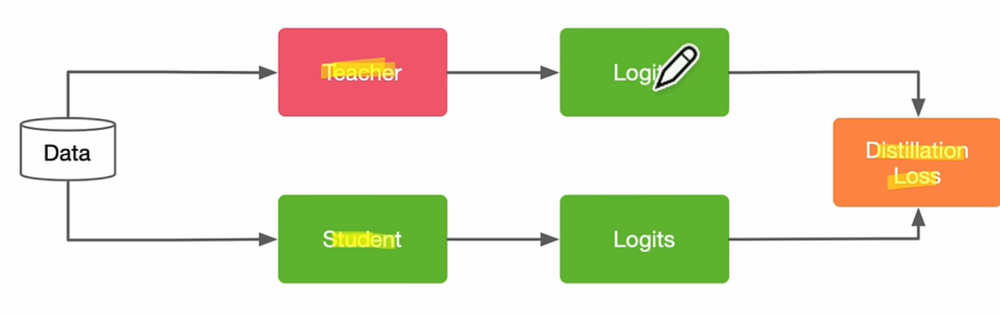
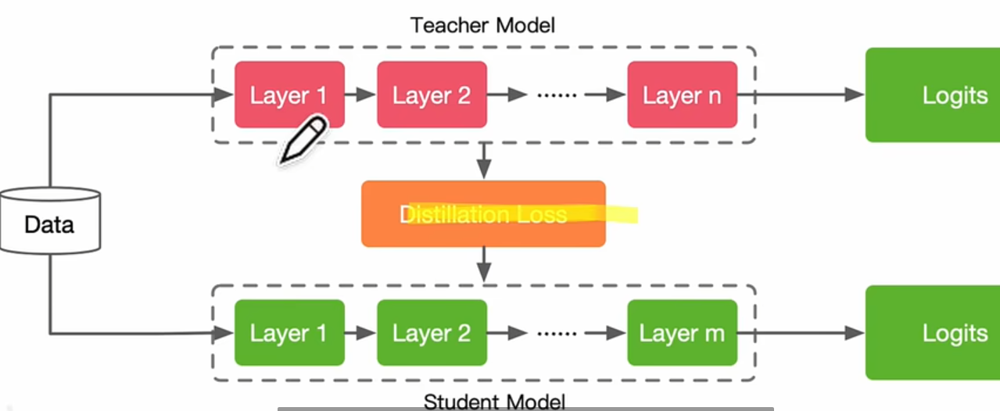
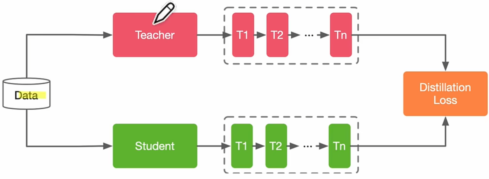

## 蒸馏的知识形态
KD:knowledge distillation知识蒸馏
### Response-Based Knowledge
主要思想：teacher model把结果教给学生,所以比较注重最后一步

老师model的Logit是比较固定的，通过训练降低学生model的Logit和老师model的Loss损失
### Feature-Based Knowledge
主要思想：将教师model的激活函数和学生model的激活函数连接起来

但是问题也很明显，teacher模型复杂度远远大于student模型的，所以你要怎么去对应计算loss是个很大的问题
### Relation-Based Knowledge

加入了数据样本的相互联系
## 蒸馏的方法
### offline distillation
目前大部分是这样蒸馏

我先把大的teacher model训练好，然后再知识迁移到student model上
### online distillation
### self-distillation