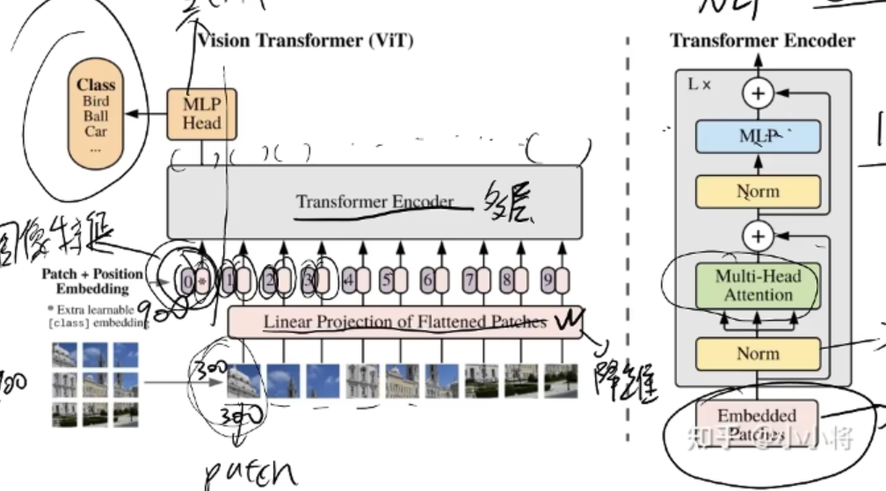
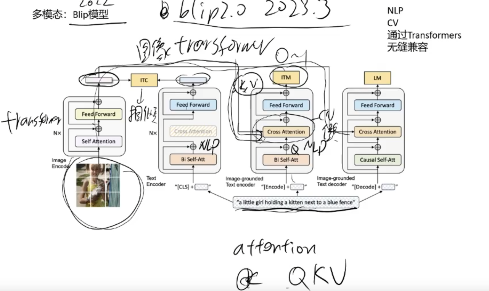
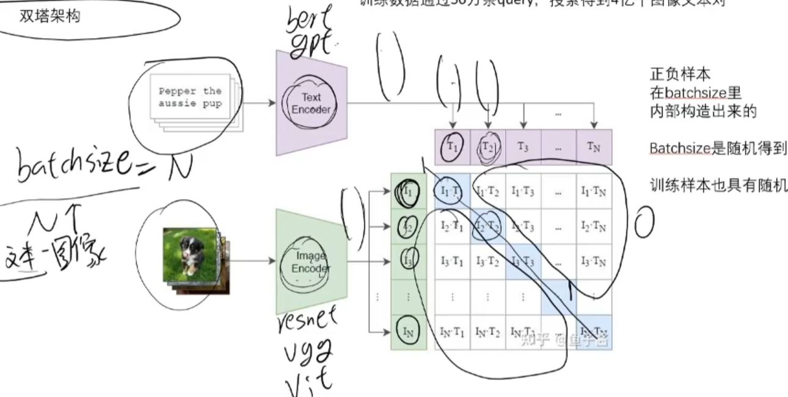
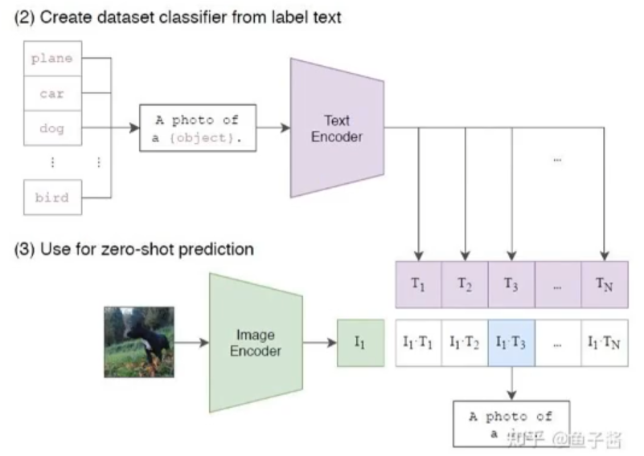
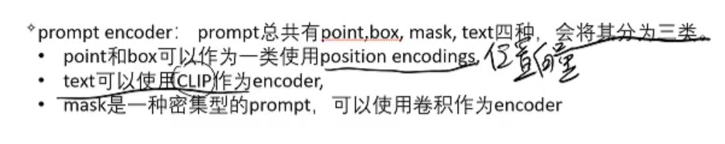
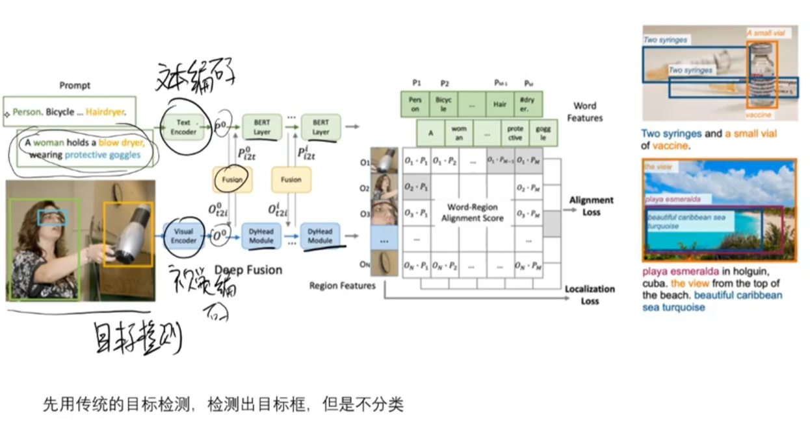
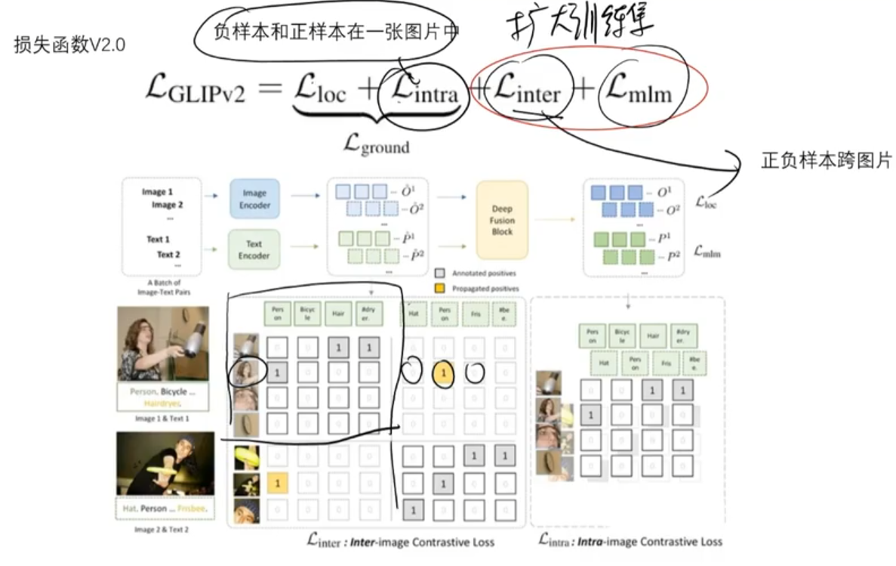
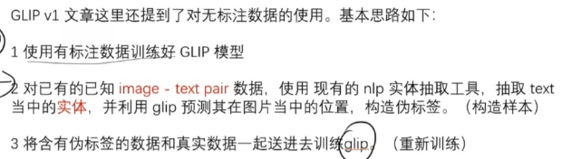
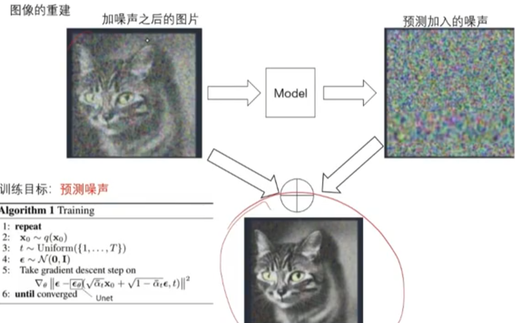
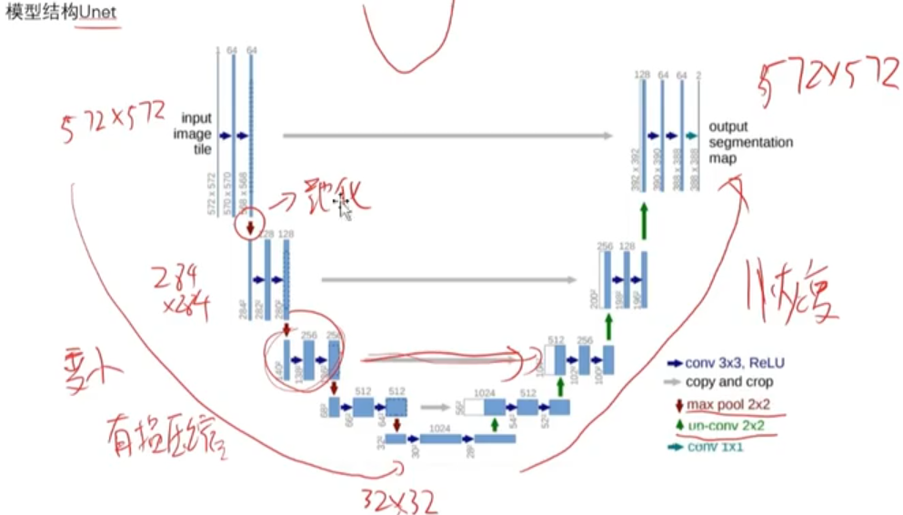

 # Vit
 Vit:Vision transformer
 
 同等效果下，transformer比CNN占参数，但是它开创了一个新的模式
 最大优势：可以和nlp结合，**做多模态**
 **仅对后几层的网络继续分类上的训练**：前几层是特征提取，后几层是图像分类

# Bootstrapped Language Image Pretraining(Blip)
用于文生图

# Contrastive(对比) Language Image Pretraining(Clip)
是个Zero-shot的模型
作用：**让图片向量和语句向量再同一空间(同一维度)**
 
 构造正负样本
 
 不同样本间**泛化能力强**，除了做分类，还能做图文匹配
 训练量大，**将分类问题转化为索引问题**
# Segment Anything(SAM)
强大之处：Zero-shot的0样本学习，泛化能力极强

目前text的segment还没开源
会返回多个结果
mask指的就是分割目标
# Grounded language Image Pretraining(Glip)
强大：Zero-shot的目标检测，**可以实现不在训练集的种类识别**

升级后的损失函数可以实现**多图片，多文本间**的损失函数计算

构造伪标签来对数据进行增强(相当于加入了很多的有标签的图片)

**实现了把分类转为匹配，理解类别语义，进行匹配**
# Stable-Diffusion
预测噪音，把噪音减去，步步推回去

Unet
 

