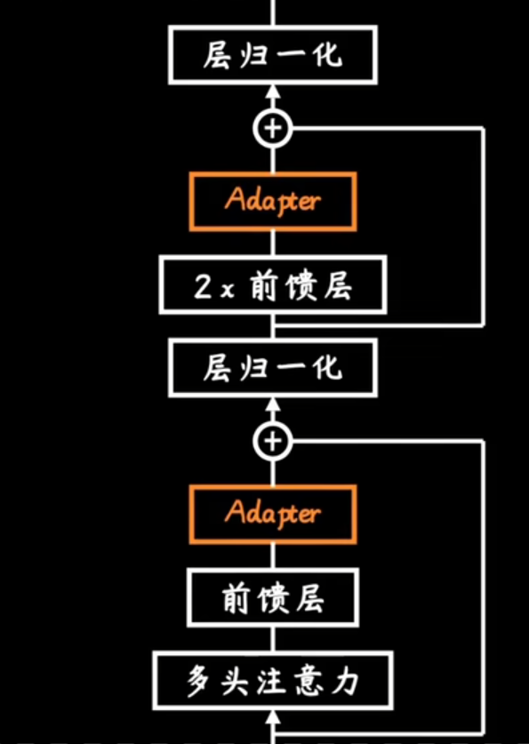
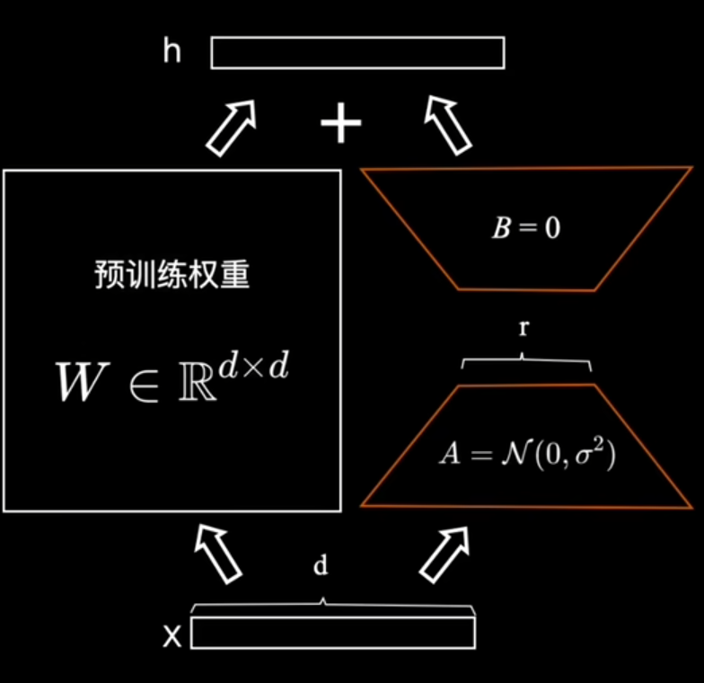
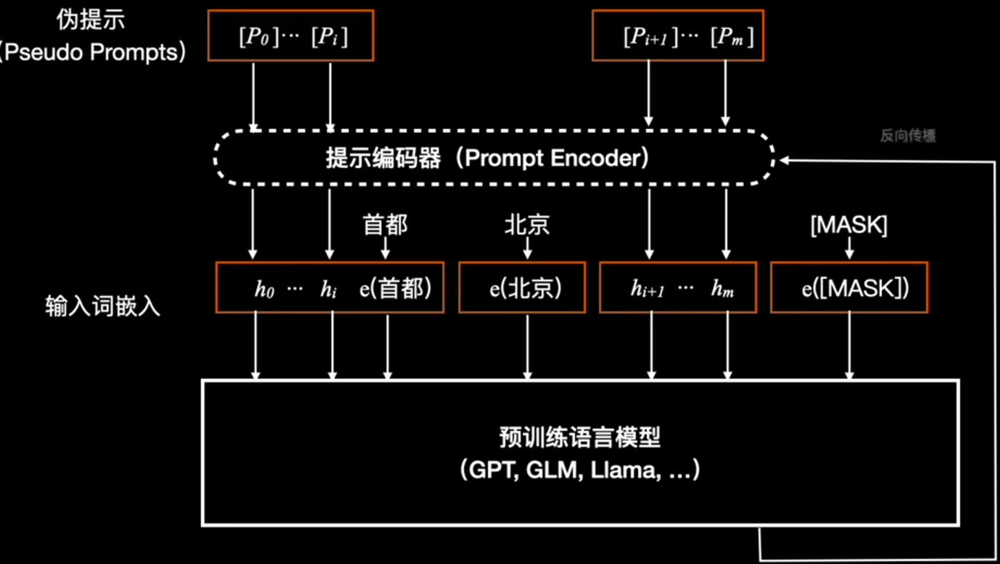
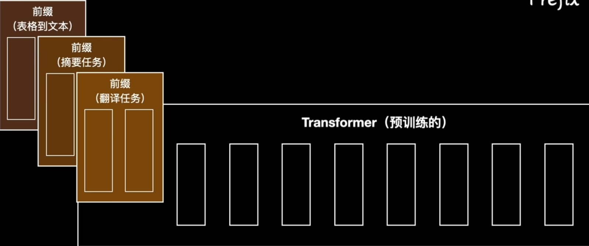

# 大模型微调

## 修改结构
### Adapter Tuning

加入adapter层，仅增加3.6%的参数实现
**adapter可以理解成严格可以调节的阀门**
### LoRA

调节低秩，实现下游任务适配
## 模板设计
### PET
### LM-BFF
### P-tuning
还是在数据上创新，加入伪提示

### profix-tuning
不改变transformer结构，而是在**训练数据格式上**创新

## 统一范式
### Prompt Tuning
简化的profix-tuning

