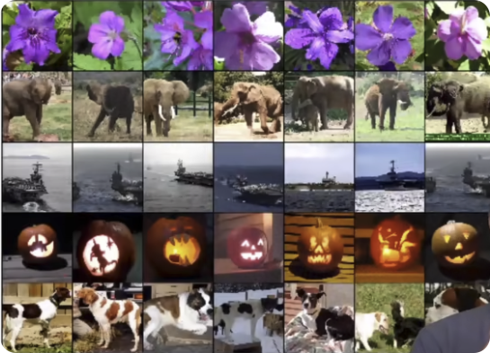

# AlexNet

## 第一遍

## abstract

摘要写的一般，更像个技术报告，就告诉你效果很好

## discussion

1. 高宽比很重要

2. AlexNet前大家在做unsupervised，AlexNet开始大家做supervised，后来的Bert才拉回到unsupervised

3. Video:1.有版权 2.数据量太大了

4. 

   展示--第一列是训练集，后几张是训练的倒数第二层向量语义空间对应出来的图片，这件事情很重要

第一遍--这篇文章效果很好，同时用神经网络做的

## 第二遍

## introduction

